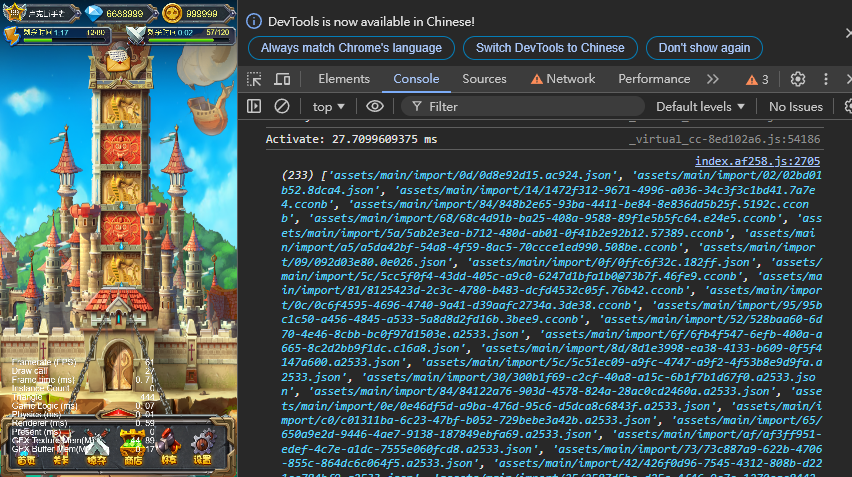
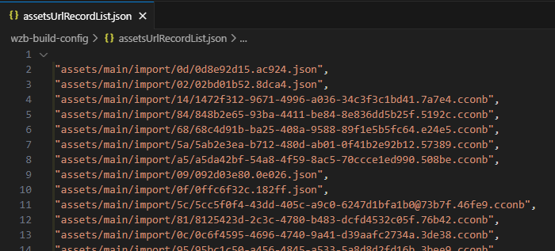

# CC3.WebZipBundle Demo

  

Cocos Creator 3.x 擴展 [WebZipBundle](https://github.com/BricL/CC3.WebZipBundle) 演示範例。

## DEMO (Host on itch.io)

* [Enable-ziploader](https://bricl.itch.io/cc3webzipbundledemo)

* [Disable-Ziploader](https://bricl.itch.io/cc3webzipbundledemo-disable-ziploader)

## How to Use

1. Select platform, `web-mobile or web-desktop`, and build the project.

2. Run the project.

3. Open the debug console of the browser, `press F12`.

4. Press `alt + w (macOS option + w)` to print the recorded assets list on the console.

    

5. Copy the content and paste it to `${YOUR_PROJECT_PATH}/wzb-build-config/assetsUrlRecordList.json`.

    

6. Build the project again.

7. Run the project again.

8. You will see the number of requests decrease dramatically.

